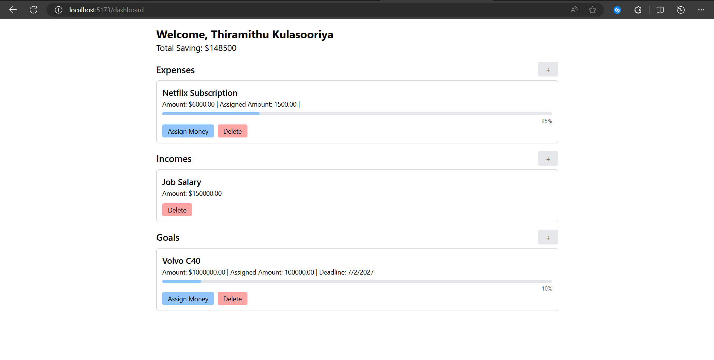

# Personal Financial Management (PFM) 

This is a personal financial management web application that helps you track your expenses, incomes, and goals. The application features a user-friendly interface for managing and monitoring your finances in real-time.



## Features

- **Dashboard Overview**: Displays an overview of total savings and categorized sections for expenses, incomes, and goals.
- **Expense Tracking**: Add, update, and delete expenses, with progress bars showing the percentage of assigned money.
- **Income Management**: Manage your sources of income with easy-to-use forms.
- **Goal Setting**: Create financial goals and track your progress towards them.
- **Responsive Design**: Optimized for mobile, tablet, and web devices.
- **Real-time Data Updates**: Efficient data fetching and state management using TanStack Query and Axios.

## Technologies Used

### Backend
- **Express**: For handling HTTP requests and routing.
- **JWT**: For secure user authentication.
- **MongoDB & Mongoose**: For data storage and ORM.
- **CORS**: To enable cross-origin requests.
- **dotenv**: For environment variable management.

### Frontend
- **React**: For building the user interface.
- **TypeScript**: For type-safe code.
- **React Query**: For efficient data fetching and caching.
- **Axios**: For making HTTP requests.
- **React Router DOM**: For client-side routing.
- **Tailwind CSS**: For responsive and clean styling.

## Installation

1. Clone the repository.
   ```bash
   git clone https://github.com/Adhishtanaka/pfm.git
   ```
2. Navigate to the project Frontend directory from root directory.
   ```bash
   cd f
   ```
3. Install the dependencies
    ```bash
   npm i
   ```
4. Set up the environment variables by creating a .env file
5. Start the development server.
   ```bash
   npm run dev
   ```
6. Navigate to the project Backend directory from root directory.
    ```bash
   cd b
   ```
7. Install the dependencies
    ```bash
   npm i
   ```
8. Set up the environment variables by creating a .env file
9. Start the express server.
     ```bash
   npm run start
     ```
   
## License

This project is licensed under the MIT License. See the [LICENSE](LICENSE) file for details.

## Contributions

Contributions are welcome! If you would like to contribute, please follow these steps:

1. Fork the repository.
2. Create a new branch (`git checkout -b feature/YourFeature`).
3. Make your changes.
4. Commit your changes (`git commit -m 'Add some feature'`).
5. Push to the branch (`git push origin feature/YourFeature`).
6. Open a pull request.

Please make sure your code follows the project’s coding style and that all tests pass before submitting a pull request.

## Contact 

If you have any questions or suggestions, feel free to contact Me.
